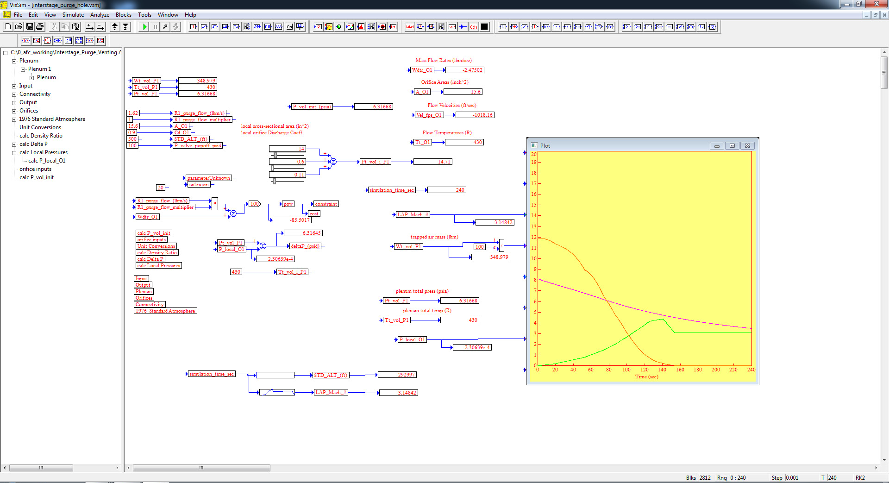
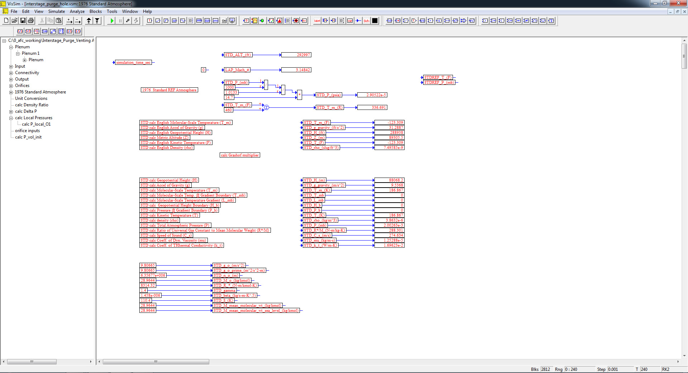
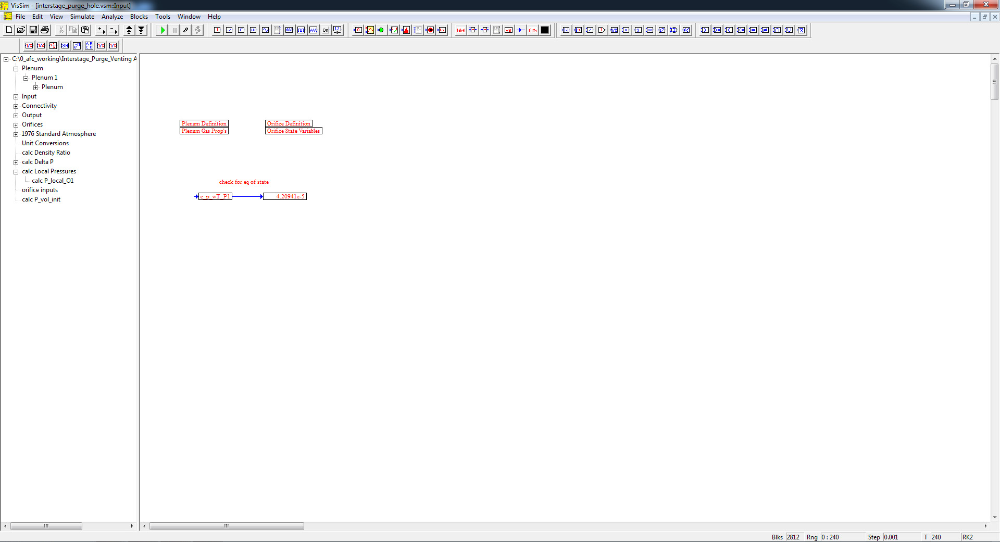
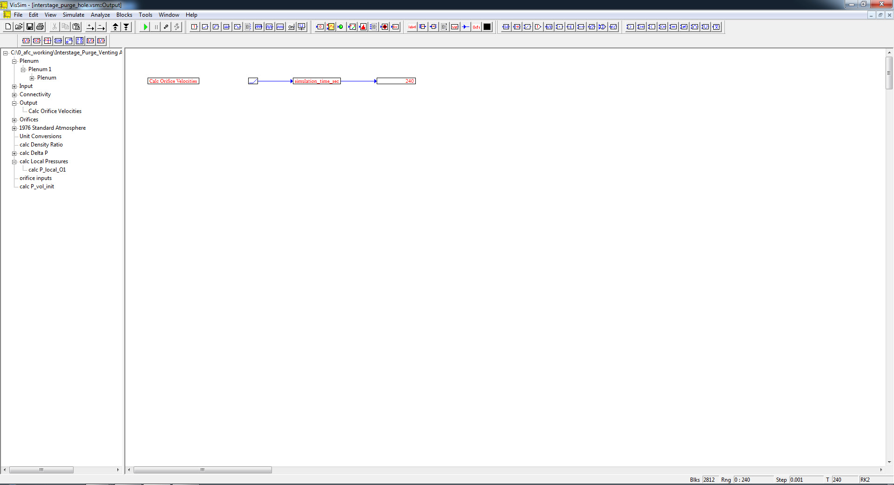
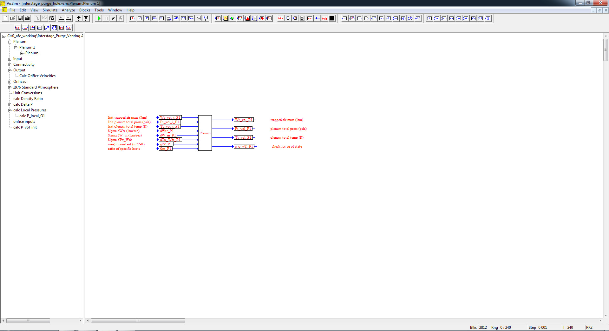
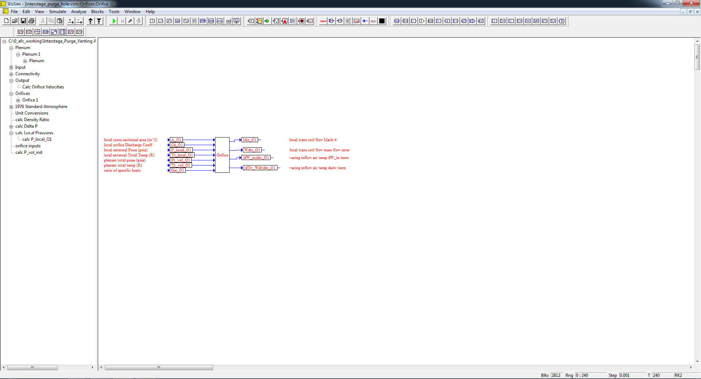

# ========================================
# Reusable Launch Vehicle Interstage Purge/Venting Analysis using VISSIM:
# ========================================

## I. InterStege Purge/Venting Analysis Top Level Diagram:

## 
## 
## II. 1976 Standard Atmosphere Model Sub-System Level Diagram:

## 
## 
## III. Input Sub-System Level Diagram:

## 
## 
## IV. Output Sub-System Level Diagram:

## 
## 
## V. Plenum Sub-System Level Diagram:

## 
## 
## VI. Orifice Sub-System Level Diagram:

## 
## *Note: Performance Data and Analysis performed using VISSIM, ( https://web.solidthinking.com/vissim-is-now-solidthinking-embed )
